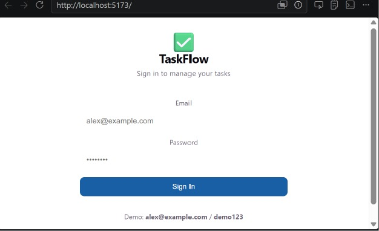

# ✅ TaskFlow — Task Management Application

A Task Management Web Application built with **React + Vite**

## 📸 Preview



---

## ✨ Features

- 🔐 **User Authentication** — Login and logout with credential validation
- 📋 **Task CRUD** — Create, Read, Update, and Delete tasks
- 🗂️ **Kanban Board** — Drag and drop tasks between status columns
- 📊 **Dashboard** — Stats overview, progress bars, category & priority breakdown
- 🔍 **Search & Filter** — Filter by status, priority, category; sort by date or priority
- 🏷️ **Tags & Categories** — Organize tasks with custom tags and categories
- ⚠️ **Overdue Detection** — Highlights tasks past their due date
- 📱 **Responsive Design** — Works on web and mobile screens

---

## 🛠️ Tech Stack

| Technology | Purpose |
|------------|---------|
| React 18 | UI Framework |
| Vite | Build Tool & Dev Server |
| JavaScript (ES6+) | Logic & State Management |

---

## 📦 Installation & Setup

### 1. Clone the repository
\```bash
git clone https://github.com/Rishana15/taskflow.git
cd taskflow
\```

### 2. Install dependencies
\```bash
npm install
\```

### 3. Start the development server
\```bash
npm run dev
\```

### 4. Open in browser
\```
http://localhost:5173
\```

---

## 🔑 Demo Login Credentials

| Field | Value |
|-------|-------|
| Email | alex@example.com |
| Password | demo123 |

---

## 👩‍💻 Author

**Rishana**
GitHub: [@Rishana15](https://github.com/Rishana15)
